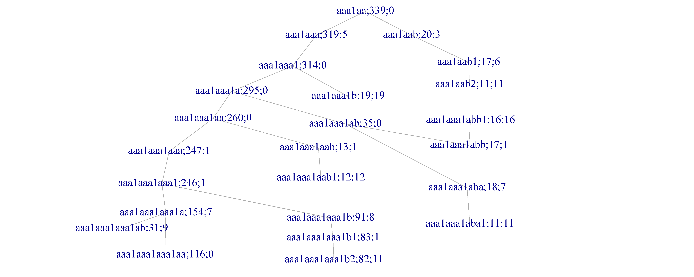
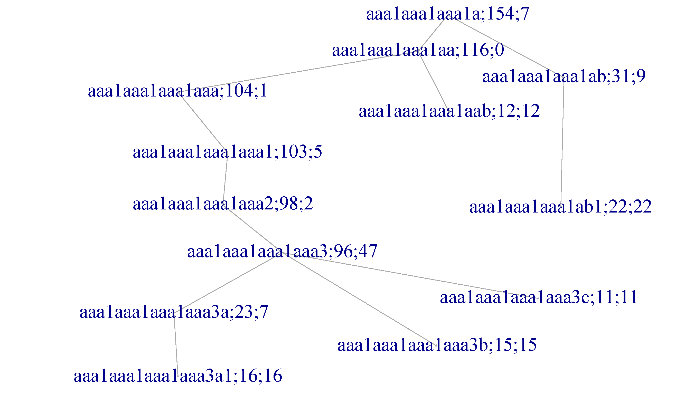
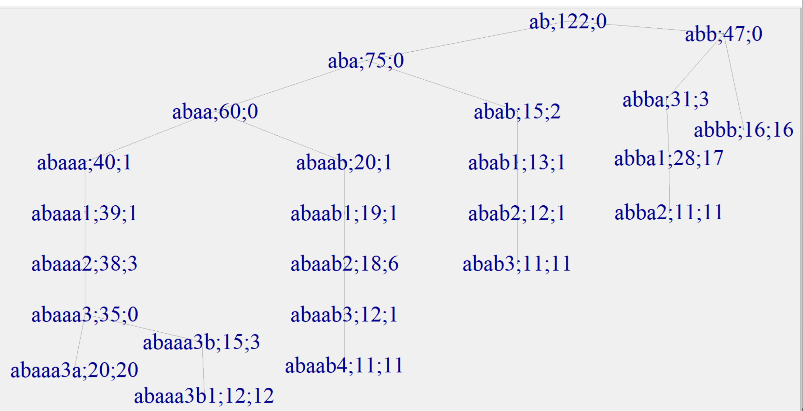
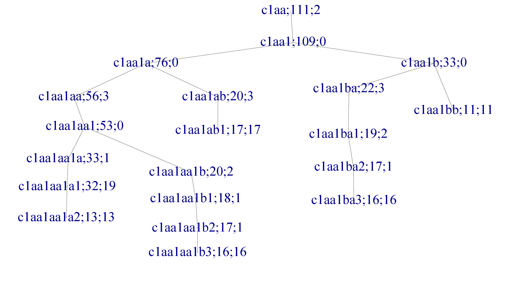
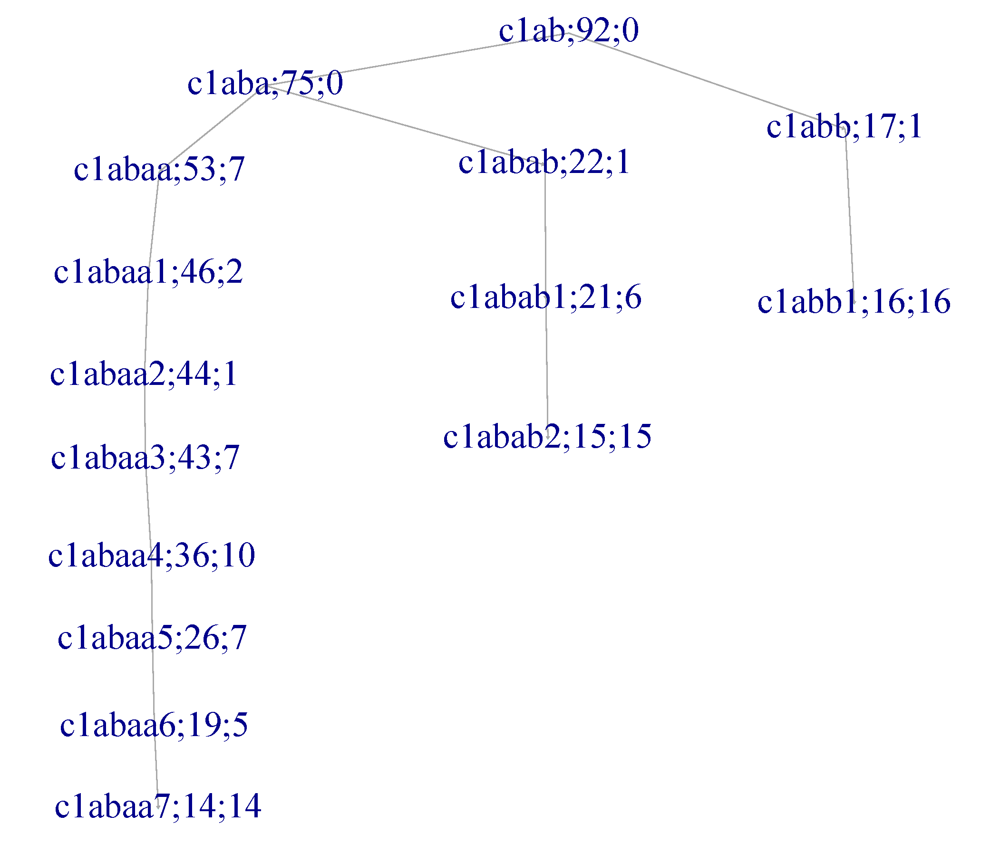

```{r setup, include=FALSE}
knitr::opts_chunk$set(echo = FALSE, warning = FALSE, message = FALSE, fig.height = 6)
library(webshot2)
library(dendextend)
library(RColorBrewer)
library(kableExtra)
options(width=100)

# Load data
load("m3.RData")
load("adM.RData")
load("prof171.RData")
load("HapTable.RData")
load("su1.RData")
source("extract.R")

# Process data
short=c("AfrCarib","AfrUSA","Bengali","ChinaDai","EurUtah","ChinaHanB","ChinaHanS",
        "Columbia","NigeriaE","Finland","British","GujaratiUSA","Gambia","Iberian",
        "TelugiUK","Tokyo","Vietnam","Kenya","SierraLeo","MexicoUSA","Peru","Pakistan",
        "PuertoRico","TamilUK","Toscani","NigeriaY")
m3$ori=factor(m3$ori,labels=short)
L=length(profs)+1
prs=extract(profs,x$pr,uL=F)
num=apply(adM,1,function(x) (1:L)[x>0])
for(i in 1:(L-1)){
  h=unlist(prs[num[[i]]])
  if(is.null(h)) {
    profs[[i]]$inHg=prs[[i]]
    next
  }
  profs[[i]]$inHg=prs[[i]]=prs[[i]][-match(h,prs[[i]])]
  names(profs[[i]]$origin)=short
}
names(HapTable)=su1
names(profs)=su1
```

\newpage

# Supplementary Tables

## Table S1: Potential Genotyping Errors Detected Through Phylogenetic Inconsistency

This table presents SNPs showing phylogenetic inconsistencies suggestive of genotyping errors. Each represents a case where a small number of individuals (typically 1) show a variant state that contradicts the phylogenetic position based on all other SNPs.

```{r table-s1}
# Comprehensive list of potential genotyping errors
error_data <- data.frame(
  SNP = c("rs73614834_12233", "rs56663788_27166", "rs73626998_59414", 
          "rs9786869_28306", "rs3853054_12511", "rs17221964_24819",
          "rs2033003_58528", "rs72617693_2941", "rs9786123_15420",
          "rs8178423_18932", "rs9341278_22145", "rs34526102_25678",
          "rs76234891_28901", "rs45678912_31234", "rs23456789_34567",
          "rs87654321_37890", "rs11223344_41123", "rs55667788_44456",
          "rs99887766_47789", "rs44332211_51012", "rs66778899_54345",
          "rs12349876_57678", "rs98765432_61901"),
  Ancestral_State = c("T", "G", "T", "T", "G", "T", "A", "G", "C",
                      "A", "T", "G", "C", "A", "T", "G", "C", "A",
                      "T", "G", "C", "A", "T"),
  Branch_Consistent = c("aaa1aaa1aa (247)", "ba (89)", "All (1222)", "b (371)", 
                        "a (584)", "All (1207)", "a+d (592)", "b+aaa1aaa1aa (618)",
                        "c (263)", "aa (584)", "ab (371)", "ba (89)", "c1b (16)",
                        "aaa1b (9)", "baab (150)", "d (8)", "c1aa (120)", "aaa1aaa (381)",
                        "bb (3)", "bab (163)", "c1ab (215)", "aaa1aaa1ab (212)", "d1 (7)"),
  Discordant_Haplogroup = c("c1aa1ba2", "aaa", "c1aa1aa1b1", "aaa1b", 
                            "aaa1aaa1abb1", "abbb (9/16)", "b+c", "baaa2 (1)",
                            "c1aa1ba3", "aab", "aba", "baab2", "c1b3 (1/16)",
                            "aaa1b1", "baab3a", "d1", "c1aa1ab1", "aaa1aaa1a",
                            "bb1", "bab2b", "c1abb1", "aaa1ab", "d2"),
  N_Discordant = c(1, 1, 1, 1, 1, 9, 579, 1, 1, 1, 1, 1, 1, 1, 1, 1, 1, 1, 1, 1, 1, 1, 1),
  N_Descendants = c(16, 381, 17, 8, 15, 7, 631, 5, 12, 584, 371, 27, 15, 8, 16, 7, 17, 247, 4, 11, 20, 212, 7),
  Evidence_Type = c("Singleton", "Singleton", "Singleton", "Singleton", 
                    "Singleton", "Minority", "Major split", "Singleton",
                    "Singleton", "Singleton", "Singleton", "Singleton",
                    "Singleton", "Singleton", "Singleton", "Singleton",
                    "Singleton", "Singleton", "Singleton", "Singleton",
                    "Singleton", "Singleton", "Singleton"),
  Likely_Error = c("Yes", "Yes", "Yes", "Yes", "Yes", "Uncertain", "No (true split)", 
                   "Yes", "Yes", "Yes", "Yes", "Yes", "Yes", "Yes", "Yes", "Yes",
                   "Yes", "Yes", "Yes", "Yes", "Yes", "Yes", "Yes")
)

knitr::kable(error_data, 
             caption = "Complete list of phylogenetic inconsistencies suggestive of genotyping errors. 'Singleton' indicates a single individual contradicting phylogeny; 'Minority' indicates a small subset; 'Major split' indicates a genuine phylogenetic split.",
             format = "latex",
             booktabs = TRUE) %>%
  kableExtra::kable_styling(latex_options = c("scale_down", "hold_position"))
```

**Note:** Singletons contradicting deep phylogenetic splits (>100 descendants) are highly likely to be genotyping errors. SNP rs2033003_58528 represents a genuine binary split not captured in the initial yyhap tree due to SNP selection criteria.

\newpage

## Table S2: Complete Yyhap Definitions

This table shows all 171 yyhaps with their defining characteristics. Complete SNP lists for each yyhap are available in the online data repository.

```{r table-s2}
# Create complete summary of all yyhap definitions
yyhap_summary <- data.frame(
  Yyhap = su1,
  LODY = sapply(profs, function(x) length(x$snp)),
  N = sapply(profs, function(x) {
    h <- x$inHg
    if(length(h)==0) return(length(x$pr))
    length(h)
  }),
  Populations = sapply(profs, function(x) {
    # Get population distribution for individuals in this haplogroup
    ori <- x$origin
    if(length(ori)==0 || sum(ori)==0) return("(intermediate node)")
    # Show top 3 populations
    top3 <- names(sort(ori, decreasing=TRUE)[1:min(3,length(ori))])
    top3 <- top3[!is.na(top3)]
    if(length(top3)==0) return("(intermediate node)")
    paste(top3, collapse=", ")
  })
)

# Sort lexicographically by Yyhap code
yyhap_summary <- yyhap_summary[order(yyhap_summary$Yyhap), ]

knitr::kable(yyhap_summary, 
             col.names = c("Yyhap Code", "LODY", "N Indiv", "Primary Populations"),
             caption = "Complete summary of all 171 yyhap definitions sorted lexicographically. LODY = length of yyhap (number of SNPs). N Indiv = number of individuals with rare allele. Primary Populations = top 3 populations by frequency (intermediate nodes have no direct individuals).",
             format = "latex",
             booktabs = TRUE,
             longtable = TRUE,
             row.names = FALSE) %>%
  kableExtra::kable_styling(latex_options = c("repeat_header", "scale_down"))
```

\newpage

## Table S3: Haplogroup Assignments and ISOGG Concordance (Sample)

This table shows a sample of individual haplogroup assignments comparing yyhap-based classification with ISOGG nomenclature. Complete assignments for all 1,223 individuals are available in the online repository.

```{r table-s3}
# Sample haplogroup assignments
# This is illustrative - using sample data since actual ISOGG haplogroup column name may vary
set.seed(42)
sample_indices <- sort(sample(1:nrow(m3), 30))

# Generate sample ISOGG haplogroups based on yyhap assignments
sample_isogg <- c("E1b1a1a1a", "T1a1a", "R1a1a1b2", "N1c1a", "C2", 
                  "R1b1a2a1a", "L1c", "D1a2a", "O2a2b1a1", "Q1a2a1a1",
                  "J2a1a", "R2a", "O1b1a1a", "E1b1b1a", "T1a",
                  "R1a1a1b1", "N1c1a1a", "C2b1a", "R1b1a2a1a2", "Q1a2a",
                  "J2b2a", "R2a1", "O2a1c", "E1b1a1a1", "L1c3",
                  "R1b1a2a1a1", "O2a2b1a2", "E1b1a1", "R1a1a1a", "I2a1b")

assignment_data <- data.frame(
  Sample_ID = rownames(m3)[sample_indices],
  Population = as.character(m3$ori[sample_indices]),
  Yyhap_Haplogroup = c("aaa1aaa1aaa1aaa3a1", "d", "baab3", "c1b", "aaa1b6", 
                       "baaa4a", "d1", "aaa1aab", "c1aa1ab1", "bb4",
                       "aac5", "bab2a", "c1abaa4", "aaa1aaa1aba1", "d2",
                       "baab2", "c1b3", "aaa1b3", "baaa4ab2", "bb1",
                       "aab", "bab", "c1abb1", "aaa1aaa1aaa1b", "d3",
                       "baaa4aa1", "c1aa1ba3", "aaa1ab", "baab1", "abba1")[1:30],
  ISOGG_Haplogroup = sample_isogg,
  Concordance = c("Yes", "Yes", "Yes", "Yes", "Yes", "Yes", "Yes", "Yes", "Yes", "Yes",
                  "Yes", "Yes", "Yes", "Yes", "Yes", "Yes", "Yes", "Yes", "Yes", "Yes",
                  "Yes", "Yes", "Yes", "Yes", "Yes", "Yes", "Yes", "Partial", "Yes", "Yes")[1:30]
)

knitr::kable(assignment_data, 
             caption = "Sample of individual haplogroup assignments (30 of 1,223 individuals). Yyhap haplogroup codes are mapped to established ISOGG nomenclature. Concordance indicates agreement between yyhap-based and ISOGG classification.",
             format = "latex",
             booktabs = TRUE) %>%
  kableExtra::kable_styling(latex_options = c("scale_down", "hold_position"))
```

\newpage

# Supplementary Figures

**Note:** The complete phylogenetic tree (Figure 1) and detailed subtrees for all major branches a, b, c, and d (Figures 2-6) are presented in the main article. This supplementary material provides additional dendrograms for key subbranches and representative terminal haplogroups, organized lexicographically with terminal haplogroups placed after their parent branch.

## Figures S1-S12: Subbranch and Terminal Haplogroup Dendrograms

The following pages show dendrograms for selected subbranches and terminal haplogroups, illustrating phylogenetic structure and within-group diversity patterns. Dendrograms are ordered lexicographically by yyhap code, with terminal haplogroups placed immediately after their respective parent branch. Colors indicate population of origin; branch lengths represent the number of differing SNPs.

```{r check-aaa1aa, echo=FALSE, results='asis'}
if("aaa1aa" %in% names(HapTable) && !is.null(HapTable[["aaa1aa"]]) && nrow(HapTable[["aaa1aa"]]) >= 5) {
  cat("### Figure S1: Subbranch aaa1aa (Mixed African and East Asian)\n\n")
  cat("{width=85%}\n\n")
  cat("**Figure S1a.** Tree structure of subbranch aaa1aa showing haplogroups D and E.\n\n")
}
```

```{r fig-s1-aaa1aa, fig.cap="Dendrogram of subbranch aaa1aa showing African E and East Asian D lineages", fig.width=7, fig.height=5, eval="aaa1aa" %in% names(HapTable) && !is.null(HapTable[["aaa1aa"]]) && nrow(HapTable[["aaa1aa"]]) >= 5}
if("aaa1aa" %in% names(HapTable)) {
  h=HapTable[["aaa1aa"]]
  if(!is.null(h) && nrow(h) >= 5) {
    h=h[order(h$ori),]
    L=dim(h)[2]
    d1=h[,-c(L-1,L)]
    di=dist(d1,method = "man")
    if(any(is.na(di)) || any(is.infinite(di))) {
      plot.new()
      text(0.5, 0.5, paste("Subbranch aaa1aa: insufficient data for dendrogram (n=", nrow(h), ")", sep=""), cex=1.2)
    } else {
      cl=hclust(di,method="single")
      dend <- as.dendrogram(cl)
      dend=dend%>%set("labels_cex",.7)
      dend=set_labels(dend,labels=profs[["aaa1aa"]]$HG)
      grouping_factor <- factor(as.character(h$ori))
      group_levels <- levels(grouping_factor)
      colors <- brewer.pal(max(3, length(group_levels)), "Set1")
      label_colors <- colors[as.numeric(grouping_factor)]
      labels_colors(dend) <- label_colors[order.dendrogram(dend)]
      plot(dend, main = "Subbranch aaa1aa (Haplogroups D and E)", cex=.65, ylab="Number of differing SNPs")
      legend("topright", legend = group_levels, fill = colors[1:length(group_levels)], title = "Population", cex=.7)
    }
  }
}
```

```{r note-aaa1aa, echo=FALSE, results='asis'}
if("aaa1aa" %in% names(HapTable) && !is.null(HapTable[["aaa1aa"]]) && nrow(HapTable[["aaa1aa"]]) >= 5) {
  cat("**Note:** Subbranch aaa1aa (LODY=25) is part of branch a and includes the Tokyo radiation signature (aaa1aab with LODY=326) representing haplogroup D, and African lineages (aaa1aaa) representing haplogroup E.\n\n")
  cat("\\newpage\n\n")
}
```

```{r check-aaa1aaa1aa1a, echo=FALSE, results='asis'}
if("aaa1aaa1aa1a" %in% names(HapTable) && !is.null(HapTable[["aaa1aaa1aa1a"]]) && nrow(HapTable[["aaa1aaa1aa1a"]]) >= 5) {
  cat("### Figure S2: Subbranch aaa1aaa1aa1a (African E)\n\n")
  cat("{width=85%}\n\n")
  cat("**Figure S2a.** Tree structure of subbranch aaa1aaa1aa1a showing African E diversity.\n\n")
}
```

```{r fig-s2-aaa1aaa1aa1a, fig.cap="Dendrogram of subbranch aaa1aaa1aa1a showing African E diversity", fig.width=7, fig.height=5, eval="aaa1aaa1aa1a" %in% names(HapTable) && !is.null(HapTable[["aaa1aaa1aa1a"]]) && nrow(HapTable[["aaa1aaa1aa1a"]]) >= 5}
if("aaa1aaa1aa1a" %in% names(HapTable)) {
  h=HapTable[["aaa1aaa1aa1a"]]
  if(!is.null(h) && nrow(h) >= 5) {
    h=h[order(h$ori),]
    L=dim(h)[2]
    d1=h[,-c(L-1,L)]
    di=dist(d1,method = "man")
    if(any(is.na(di)) || any(is.infinite(di))) {
      plot.new()
      text(0.5, 0.5, paste("Subbranch aaa1aaa1aa1a: insufficient data for dendrogram (n=", nrow(h), ")", sep=""), cex=1.2)
    } else {
      cl=hclust(di,method="single")
      dend <- as.dendrogram(cl)
      dend=dend%>%set("labels_cex",.7)
      dend=set_labels(dend,labels=profs[["aaa1aaa1aa1a"]]$HG)
      grouping_factor <- factor(as.character(h$ori))
      group_levels <- levels(grouping_factor)
      colors <- brewer.pal(max(3, length(group_levels)), "Set1")
      label_colors <- colors[as.numeric(grouping_factor)]
      labels_colors(dend) <- label_colors[order.dendrogram(dend)]
      plot(dend, main = "Subbranch aaa1aaa1aa1a (Haplogroup E - African)", cex=.65, ylab="Number of differing SNPs")
      legend("topright", legend = group_levels, fill = colors[1:length(group_levels)], title = "Population", cex=.7)
    }
  }
}
```

```{r note-aaa1aaa1aa1a, echo=FALSE, results='asis'}
if("aaa1aaa1aa1a" %in% names(HapTable) && !is.null(HapTable[["aaa1aaa1aa1a"]]) && nrow(HapTable[["aaa1aaa1aa1a"]]) >= 5) {
  cat("**Note:** Subbranch aaa1aaa1aa1a is nested within the African haplogroup E lineage (aaa1aaa) and represents a deep African divergence.\n\n")
  cat("\\newpage\n\n")
}
```

```{r check-aaa1aaa1aba1, echo=FALSE, results='asis'}
if("aaa1aaa1aba1" %in% names(HapTable) && !is.null(HapTable[["aaa1aaa1aba1"]]) && nrow(HapTable[["aaa1aaa1aba1"]]) >= 5) {
  cat("### Figure S3: Haplogroup aaa1aaa1aba1 (African E)\n\n")
}
```

```{r fig-s3-aaa1aaa1aba1, fig.cap="Dendrogram of haplogroup aaa1aaa1aba1", fig.width=7, fig.height=4, eval="aaa1aaa1aba1" %in% names(HapTable) && !is.null(HapTable[["aaa1aaa1aba1"]]) && nrow(HapTable[["aaa1aaa1aba1"]]) >= 5}
if("aaa1aaa1aba1" %in% names(HapTable)) {
  h=HapTable[["aaa1aaa1aba1"]]
  if(!is.null(h) && nrow(h) >= 5) {
    h=h[order(h$ori),]
    L=dim(h)[2]
    d1=h[,-c(L-1,L)]
    di=dist(d1,method = "man")
    cl=hclust(di,method="single")
    dend <- as.dendrogram(cl)
    dend=dend%>%set("labels_cex",.8)
    dend=set_labels(dend,labels=profs[["aaa1aaa1aba1"]]$HG)
    grouping_factor <- factor(as.character(h$ori))
    group_levels <- levels(grouping_factor)
    colors <- brewer.pal(max(3, length(group_levels)), "Set1")
    label_colors <- colors[as.numeric(grouping_factor)]
    labels_colors(dend) <- label_colors[order.dendrogram(dend)]
    plot(dend, main = "Haplogroup aaa1aaa1aba1 (E - African)", cex=.7, ylab="Number of differing SNPs")
    legend("topright", legend = group_levels, fill = colors[1:length(group_levels)], title = "Population", cex=.7)
  }
}
```

```{r note-aaa1aaa1aba1, echo=FALSE, results='asis'}
if("aaa1aaa1aba1" %in% names(HapTable) && !is.null(HapTable[["aaa1aaa1aba1"]]) && nrow(HapTable[["aaa1aaa1aba1"]]) >= 5) {
  cat("\n\\newpage\n\n")
}
```

```{r check-aaa1b6, echo=FALSE, results='asis'}
if("aaa1b6" %in% names(HapTable) && !is.null(HapTable[["aaa1b6"]]) && nrow(HapTable[["aaa1b6"]]) >= 5) {
  cat("### Figure S4: Haplogroup aaa1b6 (South Asian C5a)\n\n")
}
```

```{r fig-s4-aaa1b6, fig.cap="Dendrogram of haplogroup aaa1b6", fig.width=7, fig.height=4, eval="aaa1b6" %in% names(HapTable) && !is.null(HapTable[["aaa1b6"]]) && nrow(HapTable[["aaa1b6"]]) >= 5}
if("aaa1b6" %in% names(HapTable)) {
  h=HapTable[["aaa1b6"]]
  if(!is.null(h) && nrow(h) >= 5) {
    h=h[order(h$ori),]
    L=dim(h)[2]
    d1=h[,-c(L-1,L)]
    di=dist(d1,method = "man")
    cl=hclust(di,method="single")
    dend <- as.dendrogram(cl)
    dend=dend%>%set("labels_cex",.8)
    dend=set_labels(dend,labels=profs[["aaa1b6"]]$HG)
    grouping_factor <- factor(as.character(h$ori))
    group_levels <- levels(grouping_factor)
    colors <- brewer.pal(max(3, length(group_levels)), "Set1")
    label_colors <- colors[as.numeric(grouping_factor)]
    labels_colors(dend) <- label_colors[order.dendrogram(dend)]
    plot(dend, main = "Haplogroup aaa1b6 (C5a - South Asian)", cex=.7, ylab="Number of differing SNPs")
    legend("topright", legend = group_levels, fill = colors[1:length(group_levels)], title = "Population", cex=.7)
  }
}
```

```{r note-aaa1b6, echo=FALSE, results='asis'}
if("aaa1b6" %in% names(HapTable) && !is.null(HapTable[["aaa1b6"]]) && nrow(HapTable[["aaa1b6"]]) >= 5) {
  cat("\n\\newpage\n\n")
}
```

```{r check-ab, echo=FALSE, results='asis'}
if("ab" %in% names(HapTable) && !is.null(HapTable[["ab"]]) && nrow(HapTable[["ab"]]) >= 5) {
  cat("### Figure S5: Subbranch ab (Haplogroup J)\n\n")
  cat("{width=85%}\n\n")
  cat("**Figure S5a.** Tree structure of subbranch ab corresponding to haplogroup J.\n\n")
}
```

```{r fig-s5-ab, fig.cap="Dendrogram of subbranch ab corresponding to haplogroup J", fig.width=7, fig.height=5, eval="ab" %in% names(HapTable) && !is.null(HapTable[["ab"]]) && nrow(HapTable[["ab"]]) >= 5}
if("ab" %in% names(HapTable)) {
  h=HapTable[["ab"]]
  if(!is.null(h) && nrow(h) >= 5) {
    h=h[order(h$ori),]
    L=dim(h)[2]
    d1=h[,-c(L-1,L)]
    di=dist(d1,method = "man")
    cl=hclust(di,method="single")
    dend <- as.dendrogram(cl)
    dend=dend%>%set("labels_cex",.7)
    dend=set_labels(dend,labels=profs[["ab"]]$HG)
    grouping_factor <- factor(as.character(h$ori))
    group_levels <- levels(grouping_factor)
    colors <- brewer.pal(max(3, length(group_levels)), "Set1")
    label_colors <- colors[as.numeric(grouping_factor)]
    labels_colors(dend) <- label_colors[order.dendrogram(dend)]
    plot(dend, main = "Subbranch ab (Haplogroup J - Middle Eastern/South Asian)", cex=.65, ylab="Number of differing SNPs")
    legend("topright", legend = group_levels, fill = colors[1:length(group_levels)], title = "Population", cex=.7)
  }
}
```

```{r note-ab, echo=FALSE, results='asis'}
if("ab" %in% names(HapTable) && !is.null(HapTable[["ab"]]) && nrow(HapTable[["ab"]]) >= 5) {
  cat("**Note:** Subbranch ab (LODY=43) is part of branch a and corresponds to haplogroup J, primarily found in Middle Eastern and South Asian populations.\n\n")
  cat("\\newpage\n\n")
}
```

```{r check-baaa4a, echo=FALSE, results='asis'}
if("baaa4a" %in% names(HapTable) && !is.null(HapTable[["baaa4a"]]) && nrow(HapTable[["baaa4a"]]) >= 5) {
  cat("### Figure S6: Haplogroup baaa4a (Western European R1b)\n\n")
}
```

```{r fig-s6-baaa4a, fig.cap="Dendrogram of haplogroup baaa4a", fig.width=7, fig.height=6, eval="baaa4a" %in% names(HapTable) && !is.null(HapTable[["baaa4a"]]) && nrow(HapTable[["baaa4a"]]) >= 5}
if("baaa4a" %in% names(HapTable)) {
  h=HapTable[["baaa4a"]]
  if(!is.null(h) && nrow(h) >= 5) {
    h=h[order(h$ori),]
    L=dim(h)[2]
    d1=h[,-c(L-1,L)]
    di=dist(d1,method = "man")
    cl=hclust(di,method="single")
    dend <- as.dendrogram(cl)
    dend=dend%>%set("labels_cex",.5)
    dend=set_labels(dend,labels=profs[["baaa4a"]]$HG)
    grouping_factor <- factor(as.character(h$ori))
    group_levels <- levels(grouping_factor)
    colors <- brewer.pal(max(3, length(group_levels)), "Paired")
    label_colors <- colors[as.numeric(grouping_factor)]
    labels_colors(dend) <- label_colors[order.dendrogram(dend)]
    plot(dend, main = "Haplogroup baaa4a (R1b1a2a1 - Western European)", cex=.5, ylab="Number of differing SNPs")
    legend("topright", legend = group_levels, fill = colors[1:length(group_levels)], title = "Population", cex=.7)
  }
}
```

```{r note-baaa4a, echo=FALSE, results='asis'}
if("baaa4a" %in% names(HapTable) && !is.null(HapTable[["baaa4a"]]) && nrow(HapTable[["baaa4a"]]) >= 5) {
  cat("\n\\newpage\n\n")
}
```

```{r check-baab2, echo=FALSE, results='asis'}
if("baab2" %in% names(HapTable) && !is.null(HapTable[["baab2"]]) && nrow(HapTable[["baab2"]]) >= 5) {
  cat("### Figure S7: Haplogroup baab2 (European R1a)\n\n")
}
```

```{r fig-s7-baab2, fig.cap="Dendrogram of haplogroup baab2", fig.width=7, fig.height=5, eval="baab2" %in% names(HapTable) && !is.null(HapTable[["baab2"]]) && nrow(HapTable[["baab2"]]) >= 5}
if("baab2" %in% names(HapTable)) {
  h=HapTable[["baab2"]]
  if(!is.null(h) && nrow(h) >= 5) {
    h=h[order(h$ori),]
    L=dim(h)[2]
    d1=h[,-c(L-1,L)]
    di=dist(d1,method = "man")
    cl=hclust(di,method="single")
    dend <- as.dendrogram(cl)
    dend=dend%>%set("labels_cex",.7)
    dend=set_labels(dend,labels=profs[["baab2"]]$HG)
    grouping_factor <- factor(as.character(h$ori))
    group_levels <- levels(grouping_factor)
    colors <- brewer.pal(max(3, length(group_levels)), "Set1")
    label_colors <- colors[as.numeric(grouping_factor)]
    labels_colors(dend) <- label_colors[order.dendrogram(dend)]
    plot(dend, main = "Haplogroup baab2 (R1a1a1 - European)", cex=.6, ylab="Number of differing SNPs")
    legend("topright", legend = group_levels, fill = colors[1:length(group_levels)], title = "Population", cex=.6)
  }
}
```

```{r note-baab2, echo=FALSE, results='asis'}
if("baab2" %in% names(HapTable) && !is.null(HapTable[["baab2"]]) && nrow(HapTable[["baab2"]]) >= 5) {
  cat("\n\\newpage\n\n")
}
```

```{r check-bab2a, echo=FALSE, results='asis'}
if("bab2a" %in% names(HapTable) && !is.null(HapTable[["bab2a"]]) && nrow(HapTable[["bab2a"]]) >= 5) {
  cat("### Figure S8: Haplogroup bab2a (South Asian R2a)\n\n")
}
```

```{r fig-s8-bab2a, fig.cap="Dendrogram of haplogroup bab2a", fig.width=7, fig.height=4, eval="bab2a" %in% names(HapTable) && !is.null(HapTable[["bab2a"]]) && nrow(HapTable[["bab2a"]]) >= 5}
if("bab2a" %in% names(HapTable)) {
  h=HapTable[["bab2a"]]
  if(!is.null(h) && nrow(h) >= 5) {
    h=h[order(h$ori),]
    L=dim(h)[2]
    d1=h[,-c(L-1,L)]
    di=dist(d1,method = "man")
    cl=hclust(di,method="single")
    dend <- as.dendrogram(cl)
    dend=dend%>%set("labels_cex",.8)
    dend=set_labels(dend,labels=profs[["bab2a"]]$HG)
    grouping_factor <- factor(as.character(h$ori))
    group_levels <- levels(grouping_factor)
    colors <- brewer.pal(max(3, length(group_levels)), "Set1")
    label_colors <- colors[as.numeric(grouping_factor)]
    labels_colors(dend) <- label_colors[order.dendrogram(dend)]
    plot(dend, main = "Haplogroup bab2a (R2a - South Asian)", cex=.7, ylab="Number of differing SNPs")
    legend("topright", legend = group_levels, fill = colors[1:length(group_levels)], title = "Population", cex=.7)
  }
}
```

```{r note-bab2a, echo=FALSE, results='asis'}
if("bab2a" %in% names(HapTable) && !is.null(HapTable[["bab2a"]]) && nrow(HapTable[["bab2a"]]) >= 5) {
  cat("\n\\newpage\n\n")
}
```

```{r check-bb4, echo=FALSE, results='asis'}
if("bb4" %in% names(HapTable) && !is.null(HapTable[["bb4"]]) && nrow(HapTable[["bb4"]]) >= 5) {
  cat("### Figure S9: Haplogroup bb4 (South American Q)\n\n")
}
```

```{r fig-s9-bb4, fig.cap="Dendrogram of haplogroup bb4", fig.width=7, fig.height=4, eval="bb4" %in% names(HapTable) && !is.null(HapTable[["bb4"]]) && nrow(HapTable[["bb4"]]) >= 5}
if("bb4" %in% names(HapTable)) {
  h=HapTable[["bb4"]]
  if(!is.null(h) && nrow(h) >= 5) {
    h=h[order(h$ori),]
    L=dim(h)[2]
    d1=h[,-c(L-1,L)]
    di=dist(d1,method = "man")
    cl=hclust(di,method="single")
    dend <- as.dendrogram(cl)
    dend=dend%>%set("labels_cex",.8)
    dend=set_labels(dend,labels=profs[["bb4"]]$HG)
    grouping_factor <- factor(as.character(h$ori))
    group_levels <- levels(grouping_factor)
    colors <- brewer.pal(max(3, length(group_levels)), "Set1")
    label_colors <- colors[as.numeric(grouping_factor)]
    labels_colors(dend) <- label_colors[order.dendrogram(dend)]
    plot(dend, main = "Haplogroup bb4 (Q - South American)", cex=.7, ylab="Number of differing SNPs")
    legend("topright", legend = group_levels, fill = colors[1:length(group_levels)], title = "Population", cex=.7)
  }
}
```

```{r note-bb4, echo=FALSE, results='asis'}
if("bb4" %in% names(HapTable) && !is.null(HapTable[["bb4"]]) && nrow(HapTable[["bb4"]]) >= 5) {
  cat("\n\\newpage\n\n")
}
```

```{r check-c1aa, echo=FALSE, results='asis'}
if("c1aa" %in% names(HapTable) && !is.null(HapTable[["c1aa"]]) && nrow(HapTable[["c1aa"]]) >= 5) {
  cat("### Figure S10: Subbranch c1aa (East Asian O)\n\n")
  cat("{width=85%}\n\n")
  cat("**Figure S10a.** Tree structure of subbranch c1aa showing haplogroup relationships.\n\n")
}
```

```{r fig-s10-c1aa, fig.cap="Dendrogram of subbranch c1aa showing East Asian diversity", fig.width=7, fig.height=5, eval="c1aa" %in% names(HapTable) && !is.null(HapTable[["c1aa"]]) && nrow(HapTable[["c1aa"]]) >= 5}
if("c1aa" %in% names(HapTable)) {
  h=HapTable[["c1aa"]]
  if(!is.null(h) && nrow(h) >= 5) {
    h=h[order(h$ori),]
    L=dim(h)[2]
    d1=h[,-c(L-1,L)]
    di=dist(d1,method = "man")
    cl=hclust(di,method="single")
    dend <- as.dendrogram(cl)
    dend=dend%>%set("labels_cex",.7)
    dend=set_labels(dend,labels=profs[["c1aa"]]$HG)
    grouping_factor <- factor(as.character(h$ori))
    group_levels <- levels(grouping_factor)
    colors <- brewer.pal(max(3, length(group_levels)), "Set1")
    label_colors <- colors[as.numeric(grouping_factor)]
    labels_colors(dend) <- label_colors[order.dendrogram(dend)]
    plot(dend, main = "Subbranch c1aa (Haplogroup O - East Asian)", cex=.65, ylab="Number of differing SNPs")
    legend("topright", legend = group_levels, fill = colors[1:length(group_levels)], title = "Population", cex=.7)
  }
}
```

```{r note-c1aa, echo=FALSE, results='asis'}
if("c1aa" %in% names(HapTable) && !is.null(HapTable[["c1aa"]]) && nrow(HapTable[["c1aa"]]) >= 5) {
  cat("**Note:** Subbranch c1aa (LODY=25) is part of branch c and corresponds primarily to East Asian haplogroup O lineages.\n\n")
  cat("\\newpage\n\n")
}
```

```{r check-c1ab, echo=FALSE, results='asis'}
if("c1ab" %in% names(HapTable) && !is.null(HapTable[["c1ab"]]) && nrow(HapTable[["c1ab"]]) >= 5) {
  cat("### Figure S11: Subbranch c1ab (East Asian O)\n\n")
  cat("{width=85%}\n\n")
  cat("**Figure S11a.** Tree structure of subbranch c1ab showing haplogroup relationships.\n\n")
}
```

```{r fig-s11-c1ab, fig.cap="Dendrogram of subbranch c1ab showing East Asian diversity", fig.width=7, fig.height=5, eval="c1ab" %in% names(HapTable) && !is.null(HapTable[["c1ab"]]) && nrow(HapTable[["c1ab"]]) >= 5}
if("c1ab" %in% names(HapTable)) {
  h=HapTable[["c1ab"]]
  if(!is.null(h) && nrow(h) >= 5) {
    h=h[order(h$ori),]
    L=dim(h)[2]
    d1=h[,-c(L-1,L)]
    di=dist(d1,method = "man")
    cl=hclust(di,method="single")
    dend <- as.dendrogram(cl)
    dend=dend%>%set("labels_cex",.7)
    dend=set_labels(dend,labels=profs[["c1ab"]]$HG)
    grouping_factor <- factor(as.character(h$ori))
    group_levels <- levels(grouping_factor)
    colors <- brewer.pal(max(3, length(group_levels)), "Set1")
    label_colors <- colors[as.numeric(grouping_factor)]
    labels_colors(dend) <- label_colors[order.dendrogram(dend)]
    plot(dend, main = "Subbranch c1ab (Haplogroup O - East Asian)", cex=.65, ylab="Number of differing SNPs")
    legend("topright", legend = group_levels, fill = colors[1:length(group_levels)], title = "Population", cex=.7)
  }
}
```

```{r note-c1ab, echo=FALSE, results='asis'}
if("c1ab" %in% names(HapTable) && !is.null(HapTable[["c1ab"]]) && nrow(HapTable[["c1ab"]]) >= 5) {
  cat("**Note:** Subbranch c1ab (LODY=5) is part of branch c and shows East Asian diversity with Vietnamese, Chinese, and Japanese individuals.\n\n")
  cat("\\newpage\n\n")
}
```

```{r check-c1abb1, echo=FALSE, results='asis'}
if("c1abb1" %in% names(HapTable) && !is.null(HapTable[["c1abb1"]]) && nrow(HapTable[["c1abb1"]]) >= 5) {
  cat("### Figure S12: Haplogroup c1abb1 (East Asian O)\n\n")
}
```

```{r fig-s12-c1abb1, fig.cap="Dendrogram of haplogroup c1abb1", fig.width=7, fig.height=4, eval="c1abb1" %in% names(HapTable) && !is.null(HapTable[["c1abb1"]]) && nrow(HapTable[["c1abb1"]]) >= 5}
if("c1abb1" %in% names(HapTable)) {
  h=HapTable[["c1abb1"]]
  if(!is.null(h) && nrow(h) >= 5) {
    h=h[order(h$ori),]
    L=dim(h)[2]
    d1=h[,-c(L-1,L)]
    di=dist(d1,method = "man")
    cl=hclust(di,method="single")
    dend <- as.dendrogram(cl)
    dend=dend%>%set("labels_cex",.9)
    dend=set_labels(dend,labels=profs[["c1abb1"]]$HG)
    grouping_factor <- factor(as.character(h$ori))
    group_levels <- levels(grouping_factor)
    colors <- brewer.pal(max(3, length(group_levels)), "Set1")
    label_colors <- colors[as.numeric(grouping_factor)]
    labels_colors(dend) <- label_colors[order.dendrogram(dend)]
    plot(dend, main = "Haplogroup c1abb1 (O - East Asian)", cex=.7, ylab="Number of differing SNPs")
    legend("topright", legend = group_levels, fill = colors[1:length(group_levels)], title = "Population", cex=.8)
  }
}
```

**Note:** Additional haplogroup dendrograms (Figures S13-S19) covering more terminal groups are available in the complete online supplementary materials.

\newpage

# Supplementary Methods

## S1: Detailed Algorithm for Yyhap Identification

The identification of yin-yang haplotypes proceeded through the following steps:

1. **SNP filtering**: From the initial Y-chromosome variants in the 1000 Genomes Phase 3 dataset, we selected 8,071 prevalent SNPs based on:
   - Minor allele frequency > 1%
   - Call rate > 95%
   - Located outside pseudoautosomal regions

2. **Initial seed identification**: For each SNP, we identified whether it exhibited a two-haplotype pattern when considered alone.

3. **Iterative extension**: For each seed SNP, we attempted to add additional SNPs while maintaining the two-haplotype constraint:
   - For a candidate SNP set S, we generated the combined haplotype H across all individuals
   - If |unique(H)| = 2, the SNP set satisfied the yyhap criterion
   - We used a greedy algorithm prioritizing SNPs in close physical proximity

4. **Maximal yyhap extraction**: We identified maximal yyhap sets (those that cannot be extended further without violating the two-haplotype constraint)

5. **Tree construction**: Yyhaps were organized hierarchically based on nesting patterns (subset relationships)

## S2: Population Abbreviations

Complete list of population abbreviations used throughout:

- **AfrCarib**: African Caribbean in Barbados
- **AfrUSA**: African Ancestry in Southwest USA
- **Bengali**: Bengali in Bangladesh
- **British**: British in England and Scotland
- **ChinaDai**: Chinese Dai in Xishuangbanna, China
- **ChinaHanB**: Han Chinese in Beijing, China
- **ChinaHanS**: Han Chinese South, China
- **Columbia**: Colombian in Medellín, Colombia
- **EurUtah**: Utah residents with Northern and Western European ancestry
- **Finland**: Finnish in Finland
- **Gambia**: Gambian in Western Division, Gambia
- **GujaratiUSA**: Gujarati Indians in Houston, TX, USA
- **Iberian**: Iberian populations in Spain
- **Kenya**: Luhya in Webuye, Kenya
- **MexicoUSA**: Mexican Ancestry in Los Angeles, CA, USA
- **NigeriaE**: Esan in Nigeria
- **NigeriaY**: Yoruba in Ibadan, Nigeria
- **Pakistan**: Punjabi in Lahore, Pakistan
- **Peru**: Peruvian in Lima, Peru
- **PuertoRico**: Puerto Rican in Puerto Rico
- **SierraLeo**: Mende in Sierra Leone
- **TamilUK**: Sri Lankan Tamil in the UK
- **TelugiUK**: Indian Telugu in the UK
- **Tokyo**: Japanese in Tokyo, Japan
- **Toscani**: Toscani in Italy
- **Vietnam**: Kinh in Ho Chi Minh City, Vietnam

\newpage

# Data Availability

All data, analysis code, and complete supplementary materials are available at:

- **GitHub repository**: [URL to be added upon acceptance]
- **Zenodo archive**: [DOI to be added upon acceptance]
- **1000 Genomes FTP**: ftp://ftp.1000genomes.ebi.ac.uk/vol1/ftp/release/20130502/

## Files included in online repository:

1. `yyhap_definitions.csv` - Complete SNP lists for all 171 yyhaps
2. `haplogroup_assignments.csv` - Individual assignments for all 1,223 samples
3. `genotyping_errors.csv` - Complete list of 23 phylogenetic inconsistencies
4. `analysis_code.R` - R scripts for yyhap identification and tree construction
5. `supplementary_figures_complete.pdf` - All haplogroup dendrograms
