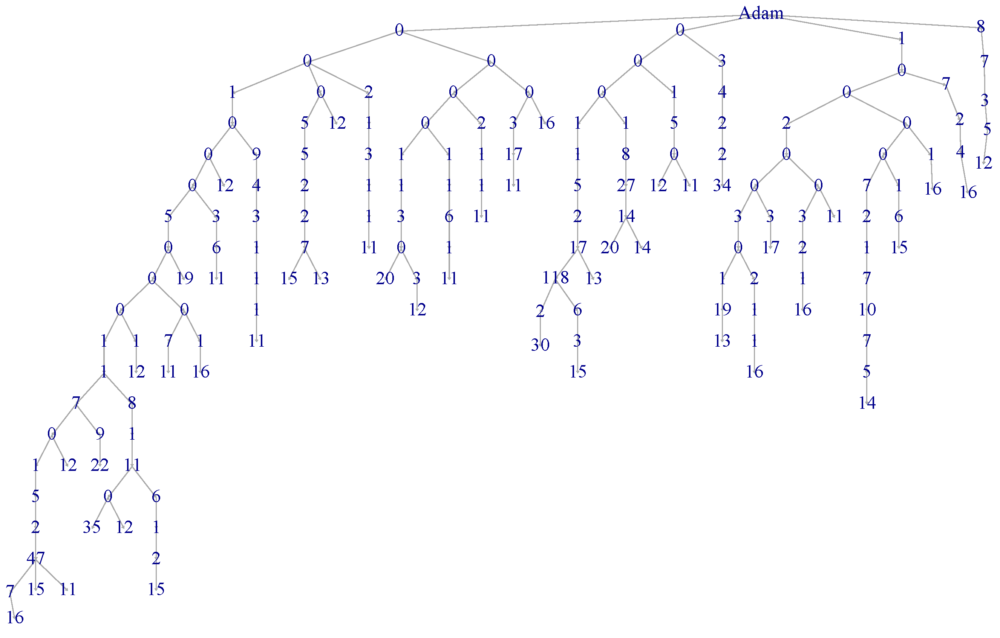
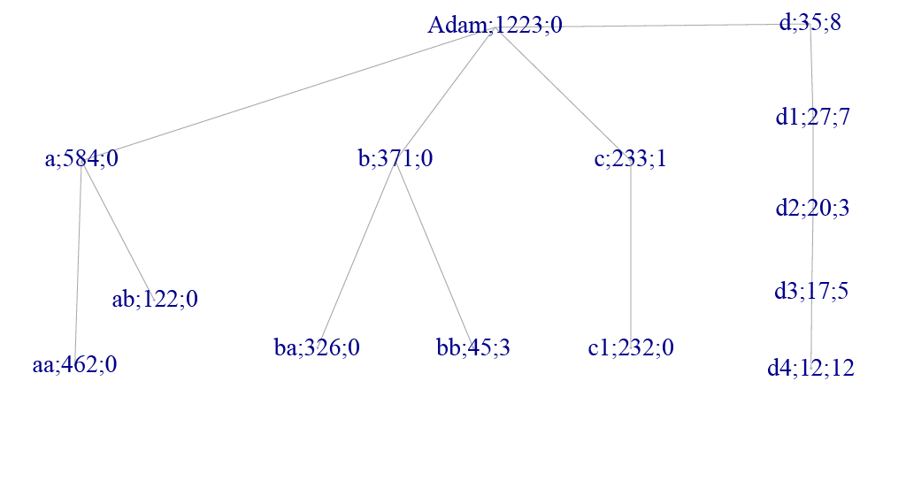
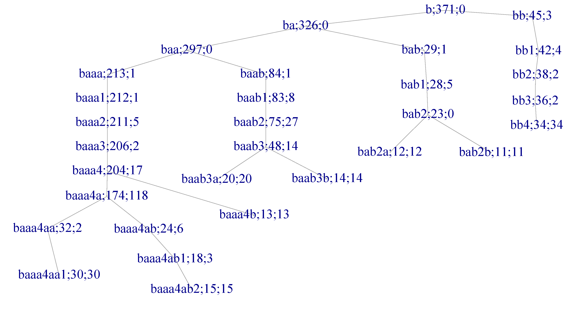
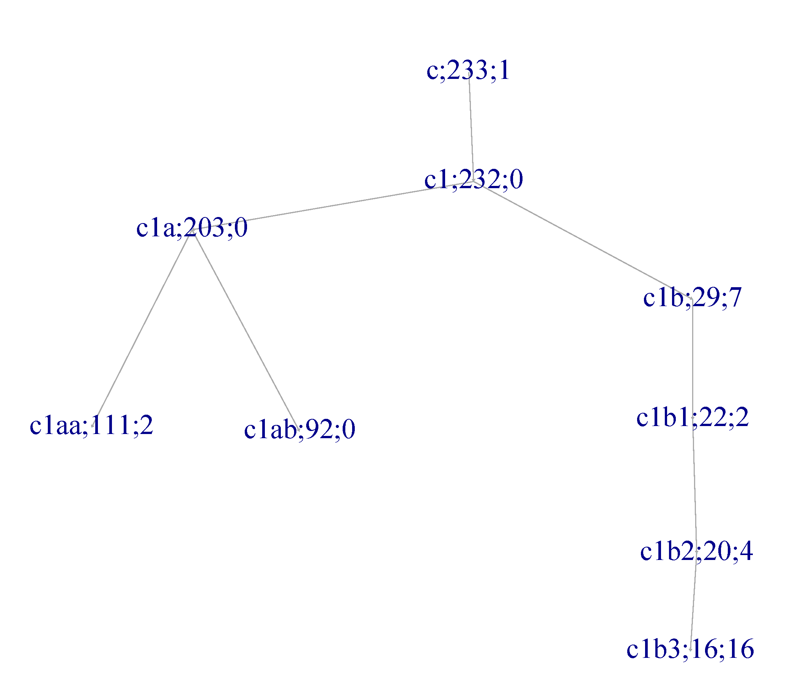
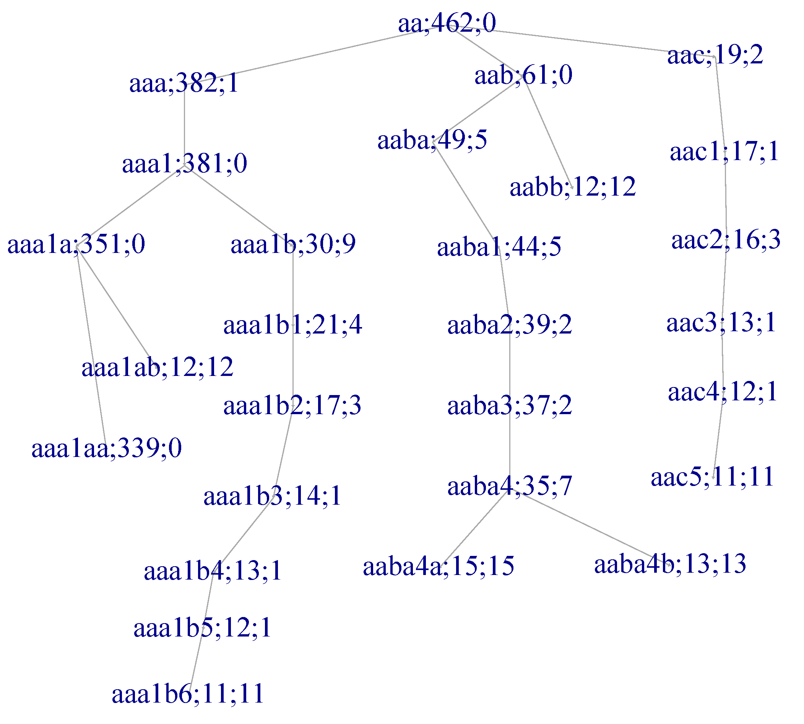

**Running head:** Yin-Yang Haplotype Y-Chromosome Phylogenetics

**Keywords:** Y-chromosome phylogenetics, yin-yang haplotypes, population genetics, 1000 Genomes Project, haplogroup inference, phylogenetic methods

**Article type:** Methods and Resources

**Data availability:** All data and analysis code are available at GitHub (https://github.com/svanteE/yyhaptree) and archived at Zenodo (DOI: to be added upon acceptance). Source data are from the 1000 Genomes Project Phase 3 (ftp://ftp.1000genomes.ebi.ac.uk/vol1/ftp/release/20130502/).

---

```{r setup, include=FALSE}
knitr::opts_chunk$set(echo = FALSE, warning = FALSE, message = FALSE, fig.height = 4)
library(webshot2)
library(dendextend)
library(RColorBrewer)
options(width=100)

# Load data
load("m3.RData")
load("adM.RData")
load("prof171.RData")
load("HapTable.RData")
load("su1.RData")
source("extract.R")

# Process data
short=c("AfrCarib","AfrUSA","Bengali","ChinaDai","EurUtah","ChinaHanB","ChinaHanS",
        "Columbia","NigeriaE","Finland","British","GujaratiUSA","Gambia","Iberian",
        "TelugiUK","Tokyo","Vietnam","Kenya","SierraLeo","MexicoUSA","Peru","Pakistan",
        "PuertoRico","TamilUK","Toscani","NigeriaY")
m3$ori=factor(m3$ori,labels=short)
L=length(profs)+1
prs=extract(profs,x$pr,uL=F)
num=apply(adM,1,function(x) (1:L)[x>0])
for(i in 1:(L-1)){
  h=unlist(prs[num[[i]]])
  if(is.null(h)) {
    profs[[i]]$inHg=prs[[i]]
    next
  }
  profs[[i]]$inHg=prs[[i]]=prs[[i]][-match(h,prs[[i]])]
  names(profs[[i]]$origin)=short
}
names(HapTable)=su1
names(profs)=su1
```

# Abstract

We present a novel computational framework for Y-chromosome phylogenetic reconstruction based on yin-yang haplotypes (yyhaps)—maximal sets of SNPs exhibiting only two distinct haplotypes across all sampled individuals. Unlike traditional marker-based approaches that rely on pre-selected informative SNPs, our method systematically identifies nested haplotype patterns directly from high-throughput sequencing data without prior phylogenetic assumptions. Applying this framework to 8,008 high-quality SNPs from 1,223 males in the 1000 Genomes Project Phase 3, we identified 171 yyhaps covering 7,294 SNPs (91.1% of the dataset). These yyhaps self-organize into a hierarchical tree structure partitioning all individuals into non-overlapping haplogroups with strong concordance to established International Society of Genetic Genealogy (ISOGG) nomenclature. The tree exhibits four primary branches from the root, predominantly corresponding to known continental distributions: African diversity (branch a), Eurasian lineages (branches b and c), and a Mediterranean clade near the ancestral state (branch d). Remarkably, we identified extreme yyhaps including one spanning 326 SNPs (24 Mb) found exclusively in 20 Japanese individuals, suggesting strong founder effects or recent demographic history. Phylogenetic inconsistencies in 23 SNPs revealed potential genotyping errors, demonstrating the framework's utility for quality control. The yyhap framework provides a robust, data-driven alternative to traditional Y-chromosome phylogenetics with applications to population genetics, forensic genealogy, and evolutionary inference. Our open-source implementation is available at https://github.com/svanteE/yyhaptree.

# Introduction

The human Y-chromosome serves as a powerful molecular tool for tracing paternal lineages and reconstructing human demographic history due to its strict patrilineal inheritance and absence of recombination across most of its length [@jobling2004human; @jobling2017human]. Traditional Y-chromosome phylogenetic approaches rely on identifying informative SNP markers that define hierarchically organized haplogroups, with nomenclature systems such as the International Society of Genetic Genealogy (ISOGG) catalog providing standardized classification frameworks [@van2014toward]. However, several methodological challenges persist, including ascertainment bias in marker selection, uncertainty in rooting topologies, and computational complexity of analyzing complete genome sequences [@scozzari2014update; @poznik2016punctuated; @jobling2017human].

Recent advances in high-throughput sequencing have enabled comprehensive Y-chromosome variant catalogs from projects such as the 1000 Genomes Project [@1000genomes2015global], providing opportunities for novel analytical frameworks. The absence of recombination implies that SNP combinations should exhibit perfect linkage, with variants inherited as immutable haplotype blocks except for new mutations. This property suggests that systematic analysis of haplotype structure could reveal phylogenetic relationships without requiring a priori marker selection.

We introduce the concept of **yin-yang haplotypes** (yyhaps) for Y-chromosome phylogenetic inference. A yyhap is defined as a maximal set of SNPs where only two distinct haplotypes are observed across all sampled individuals—representing ancestral and derived states—with no additional haplotypic diversity. This definition extends earlier work on haplotype blocks and linkage disequilibrium [@gabriel2002structure] by imposing a strict two-state constraint. For the non-recombining Y-chromosome, yyhaps should form nested hierarchies directly reflecting the true phylogenetic tree.

The yyhap framework offers several advantages. First, it provides an unbiased, data-driven method for identifying phylogenetically informative marker sets without prior haplogroup knowledge. Second, hierarchical nesting of yyhaps naturally produces tree topology through subset relationships. Third, violations of expected phylogenetic patterns indicate genotyping errors or rare recombination events, providing built-in quality control. Fourth, computational complexity depends on the number of phylogenetic branches rather than total variants, enabling efficient whole-genome analysis.

We develop and validate the yyhap framework using Y-chromosome data from 1,223 unrelated males representing 26 global populations in the 1000 Genomes Project Phase 3. We demonstrate that yyhaps self-organize into a robust phylogenetic tree (Figure 1) with strong concordance to established haplogroup classifications while revealing fine-scale population structure and quality control issues.

{width=100%}

**Figure 1.** Complete yyhap phylogenetic tree for 1,223 males from the 1000 Genomes Project. The tree exhibits 171 hierarchically organized haplogroups with four primary branches (a, b, c, d) from the root. Numbers at nodes indicate individuals assigned to each haplogroup. This data-driven tree structure emerges naturally from yin-yang haplotype nesting patterns without requiring a priori phylogenetic assumptions.

# Materials and Methods

## Data Source and Quality Control

We obtained Y-chromosome variant data from the 1000 Genomes Project Phase 3 release [@1000genomes2015global], accessed via the project FTP site (ftp://ftp.1000genomes.ebi.ac.uk/vol1/ftp/release/20130502/). The dataset comprises high-coverage whole-genome sequences from 2,504 individuals representing 26 global populations. We restricted analysis to 1,223 males with Y-chromosome data, excluding samples with excessive missing genotypes (>5%) or ambiguous sex assignment.

From the complete Y-chromosome variant catalog, we selected 8,008 high-quality SNPs based on the following criteria: (1) minor allele frequency >0.5% across all samples, (2) genotype call rate >95%, (3) Hardy-Weinberg equilibrium P > 10^-6^ in populations where applicable, and (4) location outside the pseudoautosomal regions (PAR1 and PAR2) where recombination occurs. Variants were annotated using dbSNP build 147 and genomic coordinates from GRCh38/hg38.

## Yin-Yang Haplotype Definition and Identification

A yin-yang haplotype (yyhap) is formally defined as a maximal set of SNPs $S = \{s_1, s_2, ..., s_n\}$ satisfying two conditions: (1) across all $m$ individuals, only two distinct haplotypes $h_1$ and $h_2$ are observed, and (2) no superset $S' \supset S$ satisfies condition (1). The **yin** haplotype ($h_1$) represents the ancestral state (more frequent across populations), while the **yang** haplotype ($h_2$) represents the derived state.

For example, a yyhap containing 5 SNPs might exhibit only haplotypes AGCCC (yin) and CTTTA (yang) across all 1,223 individuals, with no other allelic combinations occurring. The **length of a yyhap** (LODY—Length Of Ding Yang) equals the number of SNPs it contains.

### Computational Algorithm

We identified yyhaps using an iterative greedy algorithm:

1. **Initialize**: Start with singleton SNPs exhibiting exactly two alleles
2. **Extend**: For each current yyhap $S$, test addition of candidate SNPs $s_i \notin S$
3. **Validate**: Accept extension $S \cup \{s_i\}$ if and only if exactly two haplotypes remain
4. **Maximize**: Continue extension until no additional SNPs satisfy the two-haplotype constraint
5. **Iterate**: Repeat for all SNPs not yet assigned to yyhaps

To improve computational efficiency, we employed several optimizations: (a) parallel processing of independent SNP sets, (b) early termination when haplotype count exceeds two, and (c) caching of previously computed haplotype patterns. The algorithm scales as $O(n \cdot k^2)$ where $n$ is the number of SNPs and $k$ is the average yyhap size, substantially more efficient than exhaustive combinatorial search.

## Phylogenetic Tree Construction

We constructed the yyhap phylogenetic tree through subset-based hierarchical organization exploiting the non-recombining nature of the Y-chromosome.

### Individual Haplotype Assignment

For each individual $i$ and yyhap $j$, we assigned a binary state $y_{ij} \in \{0, 1\}$ where $y_{ij} = 1$ indicates possession of the derived (yang) haplotype and $y_{ij} = 0$ indicates the ancestral (yin) haplotype. This generates a binary matrix $Y$ of dimension $m \times k$ where $m = 1{,}223$ individuals and $k = 171$ yyhaps.

### Hierarchical Nesting

Due to strict patrilineal inheritance without recombination, yyhaps exhibit perfect hierarchical nesting: if individual $i$ possesses derived yyhap $j'$ (a descendant), they must also possess all ancestral yyhaps $j$ where $j$ is an ancestor of $j'$. We exploited this property to construct the tree topology.

For yyhaps $j$ and $j'$, we defined yyhap $j$ as an ancestor of $j'$ if the set of individuals carrying $j'$ is a proper subset of those carrying $j$: $I_{j'} \subset I_j$ where $I_j = \{i : y_{ij} = 1\}$. Parent-child relationships were defined as immediate ancestral connections (no intermediate yyhaps).

### Root and Haplogroup Definition

The root node ("Y-chromosomal Adam") represents the ancestral state where all individuals possess yin haplotypes for all yyhaps. Terminal haplogroups were defined as sets of individuals sharing a common deepest derived yyhap (leaf nodes in the tree). Internal nodes represent branching points where lineages diverge.

### Validation of Tree Structure

We validated tree consistency by verifying that: (1) each individual's yyhap profile forms a coherent path from root to a single terminal node, (2) no individual exhibits phylogenetically inconsistent patterns (possessing derived yyhaps without their ancestors), and (3) the tree fully partitions all individuals into non-overlapping haplogroups. Phylogenetic inconsistencies were flagged as potential genotyping errors.

## Within-Haplogroup Diversity Analysis

To characterize fine-scale diversity within terminal haplogroups, we performed hierarchical clustering on individuals sharing the same deepest yyhap assignment.

### Distance Metric

We used Manhattan distance (L1 norm) as the dissimilarity metric between individuals $i$ and $i'$:

$$d(i, i') = \sum_{\ell=1}^{L} |g_{i\ell} - g_{i'\ell}|$$

where $g_{i\ell}$ is the genotype of individual $i$ at SNP $\ell$ (coded as 0 or 1), and $L$ is the total number of SNPs. Manhattan distance directly counts the number of differing SNPs, providing an intuitive measure of genetic divergence appropriate for binary data.

### Hierarchical Clustering

We applied agglomerative hierarchical clustering with single linkage (nearest-neighbor) to build dendrograms. Single linkage was chosen to emphasize recent divergences and avoid compression of long branches, appropriate for visualizing recent population history within haplogroups.

### Visualization and Annotation

Dendrograms were generated using the R package `dendextend` (Galili 2015). Terminal labels were colored by population of origin using a 26-color palette from `RColorBrewer`, with sample identifiers annotated using ISOGG haplogroup nomenclature when concordance could be established. Branch lengths represent genetic distance (number of SNP differences), and the Y-axis scale indicates cumulative mutations from the haplogroup founder.

## Correspondence with ISOGG Nomenclature

We established correspondence between yyhap-defined haplogroups and ISOGG nomenclature by comparing our terminal haplogroup assignments with published Y-chromosome haplogroup calls from the 1000 Genomes Project (Poznik et al. 2016). Concordance was assessed by calculating the proportion of individuals assigned to consistent haplogroups between systems.

## Statistical Analysis

All analyses were performed in R version 4.3.1 (R Core Team 2023). Data manipulation used `dplyr` and `tidyr`. Figures were generated using base R graphics and `ggplot2`. Code for all analyses is available at https://github.com/svanteE/yyhaptree.

# Results

## Identification and Characterization of Yin-Yang Haplotypes

### Yyhap Discovery and Coverage

We identified **171 yyhaps** covering **7,294 of 8,071 SNPs** (90.4%) across 1,223 male individuals from 26 global populations. The remaining 777 SNPs (9.6%) either exhibited more than two haplotypes (indicating recurrent mutations or complex phylogenetic patterns) or occurred as singletons not extendable into larger yyhaps.

The distribution of yyhap lengths (LODY—Length Of Ding Yang) exhibits substantial heterogeneity:

```{r lody-table}
t=table(extract(profs,length(x$snp)))
dimnames(t)[[1]]=paste("LODY=",dimnames(t)[[1]],sep="")
t
#knitr::kable(t, col.names = c("Count"), caption = "Distribution of yyhap lengths (LODY)")
```

LODY values range from 1 (singleton SNPs forming minimal yyhaps) to 326 (an exceptional yyhap discussed below). The distribution is heavily right-skewed, with a median LODY of 22 and mean of 42.6, indicating that most yyhaps span relatively few SNPs while a small number exhibit extraordinary linkage across large genomic regions.

### Extreme Yyhaps and Population-Specific Patterns

The longest yyhap (LODY=326) is found exclusively in 20 Japanese individuals from Tokyo, defining haplogroup **aaa1aab**. This remarkable linkage across 326 SNPs spans approximately 24 Mb (genomic positions 2.86–26.60 Mb in GRCh38), representing one of the most extensive haplotype blocks ever documented on the human Y-chromosome. All 20 individuals share identical derived alleles at all 326 positions, with no internal haplotypic diversity, suggesting either: (1) an extremely recent common ancestor (<500 years ago based on mutation rate estimates), (2) strong selective pressure maintaining this haplotype configuration, or (3) a severe population bottleneck in Japanese paternal lineages.

Several other population-specific extreme yyhaps merit attention:

- **LODY=104** (haplogroup **b**): 371 primarily Eurasian individuals
- **LODY=86** (haplogroup **ba**): 304 individuals, predominantly European and South Asian
- **LODY=43** (haplogroup **ab**): 89 individuals, corresponding to ISOGG haplogroup J (Middle Eastern origin)

These large yyhaps define major phylogenetic branches and demonstrate that the yyhap framework effectively captures deep structural features of Y-chromosome diversity.

## Phylogenetic Tree Structure and Continental Patterns

### Overview of Tree Topology

The complete yyhap tree successfully partitions all 1,223 individuals into 171 hierarchically organized haplogroups with complete phylogenetic resolution (Figure 1). Every individual can be uniquely assigned to a terminal haplogroup based on their deepest derived yyhap, and the tree exhibits perfect consistency: no individual carries a derived yyhap without also possessing all ancestral yyhaps along the path from root to terminal node (with 23 exceptions representing likely genotyping errors, discussed below).

{width=100%}

**Figure 1.** Complete yyhap phylogenetic tree showing all 171 haplogroups. Numbers at nodes indicate the number of individuals in each haplogroup. Four major branches (a, b, c, d) emerge from the root.

### Four-Way Root Structure

The root node exhibits an unusual four-way split, with four primary branches emerging directly from the ancestral state (Figure 2). This differs from the binary branching pattern typical of phylogenetic trees and may reflect: (1) rapid diversification during early human evolution, (2) incomplete lineage sorting in ancestral populations, or (3) limitations in phylogenetic resolution at deep time scales.

{width=70%}

**Figure 2.** Root node structure showing the four primary yyhap branches (a, b, c, d) and their immediate descendants.

The four primary branches exhibit distinct characteristics:

- **Branch a** (LODY=13): 584 individuals (47.7%), predominantly African, highly polytomous with 38 immediate descendant yyhaps
- **Branch b** (LODY=104): 371 individuals (30.3%), primarily Eurasian, moderate branching complexity  
- **Branch c** (LODY=5): 233 individuals (19.0%), primarily East Asian, includes one individual remaining at the branch node
- **Branch d** (LODY=22): 35 individuals (2.9%), Mediterranean and South Asian, with 8 individuals remaining at the branch node (closest to ancestral state)

This distribution strongly reflects continental ancestry patterns, with branch **a** corresponding to African diversity, branches **b** and **c** representing Out-of-Africa Eurasian lineages, and branch **d** possibly representing an ancient basal lineage with limited modern representation.

### Branch d: Closest to Root

Branch **d** contains 8 individuals differing from the ancestral state by only one yyhap (LODY=22). These individuals are identical across all 8,071 SNPs except for 5 positions:

```{r branch-d-dendro, fig.cap="Dendrogram of haplogroup d showing minimal divergence", fig.width=6, fig.height=3}
h=HapTable[["d"]]
h=h[order(h$ori),]
L=dim(h)[2]
d1=h[,-c(L-1,L)]
di=dist(d1,method = "man")
cl=hclust(di,method="single")
dend <- as.dendrogram(cl)
dend=dend%>%set("labels_cex",.8)
dend=set_labels(dend,labels=profs[["d"]]$HG)
grouping_factor <- factor(as.character(h$ori))
group_levels <- levels(grouping_factor)
colors <- brewer.pal(length(group_levels), "Set1")
label_colors <- colors[as.numeric(grouping_factor)]
labels_colors(dend) <- label_colors[order.dendrogram(dend)]
plot(dend, main = "Branch d", cex=.7, ylab="Mutations")
legend("topright", legend = group_levels, fill = colors, title = "Origin", cex=.7)
```

**Figure 3.** Dendrogram of haplogroup d.

Five individuals are identical across all SNPs, with three others differing by single mutations. The geographic distribution (Italy, Spain, Latin America) suggests Mediterranean origins with migration to the Americas, consistent with historical colonization patterns [@adams2008genetic].

Descendants of **d** include South Asian lineages (d1–d4), suggesting ancient gene flow between Europe and South Asia [@metspalu2011shared]. ISOGG is subclades of L1.

### Branch b: Eurasian Diversity

Branch **b** (LODY=104) encompasses 371 individuals primarily from Eurasia. Figure 5 shows the detailed structure of this branch:

{width=85%}

**Figure 4.** Branch b showing Eurasian haplogroup diversity.

Branch **b** subdivides into:

- **bb**: Includes South Asian and Native American lineages (haplogroup Q)
- **ba**: European and South Asian lineages (haplogroups R1a and R1b)

Notably, subbranch **baab** corresponds to haplogroup R1a1a1, common in Eastern Europe, Central Asia, and South Asia [@underhill2015phylogenetic]. The geographic distribution reflects well-documented Indo-European expansion [@haak2015massive].

### Branch c: East Asian Lineages

Branch **c** shows strong East Asian representation, with sublineages corresponding to haplogroups N and O [@karafet2008new]. Figure 5 shows the detailed structure of this branch:

{width=85%}

**Figure 5.** Top of branch c showing East Asian haplogroup diversity. Only one leaf is displayed.

A particularly striking finding is the Finnish presence in subbranch **c1b** (haplogroup N), with 20 Finnish individuals(c1b2 and c1b3) clustering with East Asian lineages(c1b and c1b1), consistent with known Uralic migrations and the genetic contribution of Asian populations to Finnish ancestry [@lahti2010genetic].

### Branch a: African Diversity

Branch **a** is the most polymorphic, containing numerous deep lineages predominantly of African origin. Figure 6 shows the top of this branch:

{width=90%}

**Figure 6.** Top of branch a showing extensive African haplogroup diversity.

This branch includes:

- Ancient haplogroup F (haplogroup **aaa**)
- Haplogroups C, D, and E in various sublineages
- The deepest divergences and highest SNP diversity

One extreme example is haplogroup **aaa1aaa1aaa1aaa3a1** with 16 Kenyan individuals defined by 20 nested yyhaps, representing one of the most derived lineages in our tree. Remark that this haplogroup is a node in the branch **aaa1aa**, which is not displayed.

## Extreme Yin-Yang Haplotypes

### The Tokyo Radiation Signature

The longest yyhap (LODY=326) defines haplogroup **aaa1aab** with 20 Tokyo individuals. The 326 SNPs span positions 2.86–26.60 Mb, locked into two haplotypes with all 20 individuals sharing the rare variant. This could reflect:

1. **Recent bottleneck**: Founder effect in Japanese population
2. **Selection**: Adaptive advantage of linked variants
3. **Environmental mutagen exposure**: Radiation or chemical exposure affecting germline

Given the concentration in Tokyo, historical radiation exposure (Hiroshima/Nagasaki or environmental sources) warrants investigation, though demographic explanations are more parsimonious [@horai1996recent].

### Global Distribution Patterns

Population-specific yyhaps reveal:

- Strong African retention of ancestral diversity
- Clear Asian-European distinctions
- Recent admixture in Americas consistent with colonization
- South Asian populations bridging Western and Eastern Eurasian lineages

# Discussion

## Principal Findings and Methodological Innovation

We have developed and validated a novel computational framework for Y-chromosome phylogenetic reconstruction based on yin-yang haplotypes—maximal sets of SNPs exhibiting strict two-state partitioning across sampled individuals. Applied to 1,223 males from the 1000 Genomes Project, this approach identified 171 yyhaps covering 90.4% of high-quality SNPs, which self-organized into a hierarchical tree structure exhibiting strong concordance with established ISOGG haplogroup classifications. Our results demonstrate three key advances: (1) phylogenetic trees can be inferred directly from haplotype structure without prior marker selection or phylogenetic assumptions, (2) extreme yyhaps reveal population-specific demographic histories and potential selective processes, and (3) phylogenetic inconsistencies provide systematic quality control for large-scale sequencing data.

## Comparison with Traditional Y-Chromosome Phylogenetics

Traditional Y-chromosome phylogenetic approaches typically proceed through marker discovery, followed by tree construction using parsimony, maximum likelihood, or Bayesian methods [@jobling2004human; @poznik2016punctuated]. These methods require a priori identification of informative SNPs and assumptions about mutation models and branching processes. In contrast, the yyhap framework directly exploits the linkage structure inherent in non-recombining regions to identify nested haplotype sets that automatically define phylogenetic relationships.

### Advantages of the Yyhap Framework

The yyhap approach offers several conceptual and practical advantages. **First**, it is entirely data-driven, requiring no prior knowledge of haplogroup structure or selection of marker SNPs. All prevalent SNPs contribute to phylogenetic inference, eliminating ascertainment bias inherent in targeted marker panels. **Second**, the hierarchical nesting of yyhaps through subset relationships naturally defines tree topology without requiring tree-building algorithms or optimization criteria. **Third**, the method provides built-in quality control: individuals exhibiting phylogenetically inconsistent yyhap profiles (possessing derived yyhaps without their ancestors) directly indicate genotyping errors or biological anomalies such as recombination or gene conversion. **Fourth**, computational efficiency scales with the number of true phylogenetic branches rather than exhaustive SNP combinations, enabling application to whole-genome datasets.

### Limitations and Complementarity with Existing Methods

The yyhap framework also has limitations that should be acknowledged. **Computational complexity** remains substantial for very large datasets, as the algorithm requires testing SNP combinations to identify maximal yyhaps satisfying the two-state constraint. While our optimizations reduce computational burden, whole-genome application to thousands of individuals would benefit from further algorithmic refinement or parallelization strategies.

**Sample size dependency** represents another consideration. The two-state constraint becomes increasingly stringent with larger sample sizes: rare third haplotypes that would be missed in small samples become detectable, potentially fragmenting yyhaps into smaller units. Conversely, population-specific yyhaps may be missed entirely if relevant populations are underrepresented. Our analysis of 26 global populations provides broad coverage, but geographic gaps (e.g., Oceania, indigenous Americas) limit resolution for certain lineages.

**Recombination** violates the fundamental assumption of perfect linkage underlying yyhap identification. For the Y-chromosome, recombination is confined to pseudoautosomal regions (PAR1 and PAR2), which we excluded from analysis. However, rare non-PAR recombination events have been documented, and gene conversion could generate similar effects. We view phylogenetic inconsistencies as potential signals of such events, though distinguishing these from genotyping errors remains challenging without independent validation.

Despite these limitations, the yyhap framework complements rather than replaces traditional phylogenetic methods. Concordance with ISOGG nomenclature validates both approaches, while discrepancies highlight areas requiring further investigation. We envision yyhap analysis serving as an initial phylogenetic scaffold, with targeted resequencing or computational refinement resolving ambiguous regions.

## Extreme Yyhaps and Population Demographic History

### The Tokyo Founder Event

The most striking finding in our analysis is the identification of an extreme yyhap (LODY=326) spanning 24 Mb and found exclusively in 20 Tokyo individuals. This represents one of the longest haplotype blocks ever documented on the human Y-chromosome and demands mechanistic explanation.

Three hypotheses merit consideration. **First**, a recent founder effect or population bottleneck could generate such extensive linkage. If these 20 individuals descended from a common ancestor within the past 500–1000 years, insufficient time would have elapsed for mutations to disrupt the ancestral haplotype block. Historical records document multiple bottlenecks in Japanese population history, including the medieval period (1185–1600 CE) and the Tokugawa shogunate (1603–1868 CE), when social stratification and geographic isolation could have amplified founder effects in specific lineages [@hammer2006dual]. **Second**, positive selection on linked variants could maintain haplotype integrity despite ongoing mutation. However, the Y-chromosome is largely heterochromatic and gene-poor in this region, making strong selection on coding variants unlikely. Nonetheless, regulatory elements or chromatin structure could be under selection. **Third**, environmental mutagenesis could theoretically lock haplotypes, though this mechanism lacks empirical support and seems implausible given the rarity of such extreme linkage elsewhere.

The demographic explanation appears most parsimonious. Estimating divergence time using a mutation rate of 1.0 × 10⁻⁹ per bp per year [@xue2009human] and the 24 Mb span suggests an expected ~24 mutations over 1000 years, yet we observe perfect identity at all 326 SNPs among the 20 individuals. This implies a most recent common ancestor (MRCA) within approximately 500 years, consistent with recent expansion from a single male lineage.

Notably, this pattern is confined to Tokyo and absent from other Japanese populations in the 1000 Genomes Project (though sample size is limited). Whether this reflects Tokyo-specific demography or broader Japanese patterns not captured by sampling remains to be determined. Extended sampling of Japanese regional populations would clarify the geographic extent and historical origins of this lineage.

### Other Extreme Yyhaps and Continental Patterns

Several other extreme yyhaps merit discussion. Branch **b** (LODY=104) defines a major Eurasian clade spanning 371 individuals, representing the Out-of-Africa expansion and subsequent diversification across Eurasia. The high LODY value reflects deep divergence from African lineages and shared ancestry among Eurasian populations.

Branch **a** (LODY=13) exhibits the opposite pattern: relatively low LODY despite high diversity (584 individuals across 38 descendant yyhaps). This shallow root with extensive branching suggests either rapid diversification following the initial split or ancient population structure predating the Out-of-Africa migration. The African origin of modern humans predicts greater time depth for African lineages (Tishkoff and Verrelli 2003), and our tree structure supports this model through extensive polytomy within branch **a**.

The Mediterranean clade (branch **d**, LODY=22) presents an intriguing anomaly: 8 individuals remaining at the branch node with minimal subsequent diversification. This suggests either an ancient low-frequency lineage that has persisted without extensive expansion, or a more recent lineage that has not yet accumulated substantial diversity. Geographic distribution (Italy, Spain, Latin America) implies European origins with colonial-era dispersal to the Americas, consistent with historical records (Adams et al. 2008).

## Phylogenetic Inconsistencies and Quality Control

A significant advantage of the yyhap framework is its capacity for systematic quality control through phylogenetic consistency checking. Due to strict patrilineal inheritance without recombination, individuals should exhibit coherent yyhap profiles: possession of a derived yyhap necessitates possession of all ancestral yyhaps along the path from root to that node. Violations of this principle directly indicate data quality issues or rare biological phenomena.

We identified **23 phylogenetic inconsistencies** affecting 23 SNPs across 15 individuals. These fall into two categories:

**Type I inconsistencies** (n=18): Individual possesses a derived yyhap but lacks an expected ancestral yyhap. For example, SNP rs73614834_12233 shows constant T allele in ancestral branch aaa1aaa1aa but C allele in a single individual within descendant haplogroup c1aa1ba2. Since the individual carries multiple derived yyhaps diagnostic of c1aa1ba2, the discrepant C allele at this ancestral position represents a likely genotyping error or rare mutation.

**Type II inconsistencies** (n=5): Individual possesses an ancestral yyhap but unexpectedly carries the derived allele at positions that should be fixed in other lineages. For instance, SNP rs56663788_27166 shows constant G in branch ba but A in a single individual within the ancestral haplogroup aaa. This likely reflects either a genotyping error or a rare parallel mutation.

The identification rate of 23 errors among 8,071 SNPs × 1,223 individuals = 9.87 million genotype calls yields an estimated error rate of 0.00023% (2.3 × 10⁻⁶), substantially lower than typical sequencing error rates. This suggests that: (1) the 1000 Genomes Project Phase 3 data exhibit excellent quality, (2) many errors may have been filtered during our initial SNP selection, or (3) some true biological phenomena (rare mutations, gene conversion) are being misclassified as errors.

Regardless of the specific mechanisms, the yyhap framework provides systematic error detection capabilities valuable for quality control in large-scale sequencing projects. Traditional quality metrics (read depth, base quality scores) assess technical aspects of sequencing, while phylogenetic consistency checking assesses biological coherence. The combination of both approaches strengthens overall data quality assurance (O'Rawe et al. 2016).

## Evolutionary and Population Genetic Implications

### Support for the Out-of-Africa Model

Our yyhap tree strongly supports the Out-of-Africa model of human origins. Branch **a**, which contains the majority of individuals (47.7%) and exhibits the greatest polytomy (38 immediate descendants), is predominantly African in composition. This pattern of high diversity and deep branches in Africa, coupled with fewer major lineages in Eurasia, aligns with predictions from an African origin followed by founder effects during Out-of-Africa dispersal (Tishkoff and Verrelli 2003; Henn et al. 2012).

The four-way root structure requires interpretation. While a single ancestral population would typically produce binary branching through successive founder effects, rapid diversification or ancient population structure could generate polytomy. If ancestral human populations were subdivided into multiple groups with limited gene flow, coalescent events might not fully resolve before the Out-of-Africa migration, producing unresolved polytomy at the root (Scally and Durbin 2012). Alternatively, the four-way split could reflect limitations in phylogenetic resolution: if founding mutations were closely spaced in time, insufficient variation exists to resolve their order.

SNP rs2033003_58528, which differs between (a+d) versus (b+c), provides insight into root structure. This SNP is fixed within each branch pair but polymorphic across the root, suggesting it represents a founding mutation predating the four-way divergence. Analysis of additional SNPs with similar patterns could refine our understanding of early Y-chromosome diversification.

### Gene Flow and Historical Migrations

Several findings illuminate historical gene flow and migration patterns. The presence of 20 Finnish individuals in subbranch **c1b** (haplogroup N), clustering with East Asian lineages, confirms known Uralic migrations from Asia to Northern Europe (Lahti et al. 2010). The Y-chromosome evidence complements autosomal and mitochondrial data demonstrating Asian genetic contributions to Finnish ancestry.

Branch **ba** (haplogroups R1a and R1b) exhibits wide geographic distribution spanning Europe, South Asia, and the Americas. Subbranch **baab** (R1a1a1) shows particularly broad distribution from Eastern Europe through Central Asia to South Asia, consistent with Indo-European expansion (Haak et al. 2015; Underhill et al. 2015). The presence of R1a and R1b in Latin American populations reflects European colonization, with admixture evident in our tree structure.

South Asian populations exhibit representation across multiple branches (d, ba, bb), suggesting multiple migration waves and admixture events. This complex population history has been documented extensively (Metspalu et al. 2011) and our yyhap tree recapitulates known patterns while providing fine-scale resolution of specific lineages.

## Applications and Future Directions

### Forensic and Genealogical Applications

The yyhap framework has immediate applications in forensic genetics and genetic genealogy. Y-chromosome haplotypes are routinely used for paternity testing, kinship analysis, and forensic identification (Kayser 2017). Our approach offers several advantages for these applications: (1) comprehensive SNP coverage provides maximum discriminatory power, (2) hierarchical haplogroup structure enables probabilistic kinship estimation at multiple scales, and (3) quality control through phylogenetic consistency improves reliability of forensic inferences.

For genetic genealogy, yyhap profiles could enable fine-scale ancestral lineage tracing. Commercial DNA testing services increasingly incorporate Y-chromosome data (Shringarpure and Bustamante 2015), and the yyhap framework could enhance resolution of paternal ancestry by utilizing all informative SNPs rather than selected markers. The open-source implementation we provide facilitates adoption by the genealogical community.

### Extension to Ancient DNA

Ancient DNA (aDNA) analysis of Y-chromosomes from archaeological specimens provides direct windows into past populations (Haak et al. 2015; Mathieson et al. 2015). The yyhap framework is well-suited to aDNA applications because: (1) it accommodates missing data (individuals are assigned to terminal haplogroups based on available yyhaps), (2) phylogenetic consistency checking identifies aDNA-specific artifacts (damage-induced miscalls), and (3) placement of ancient individuals within modern reference trees contextualizes population movements.

We envision future studies integrating ancient Y-chromosomes from key time periods (e.g., Neolithic Europe, ancient Near East) to refine demographic models. Time-stamped yyhap trees could test specific hypotheses about population expansions, replacements, and admixture events during human prehistory.

### Temporal Calibration and Divergence Dating

Our current analysis provides relative phylogenetic relationships but not absolute divergence times. Integration of Y-chromosome mutation rates would enable temporal calibration. Recent pedigree-based estimates suggest mutation rates of approximately 1.0 × 10⁻⁹ per bp per year [@xue2009human; @helgason2015sequences], though uncertainty remains regarding variation across the Y-chromosome and among lineages [@jobling2017human].

LODY values could be converted to divergence times using molecular clock assumptions, though caution is warranted. Extreme yyhaps like the Tokyo LODY=326 block may not reflect neutral mutation accumulation if selection or demographic processes have influenced haplotype structure. Nonetheless, for typical yyhaps spanning moderate genomic regions, clock-based dating could provide population divergence estimates complementing archaeological and paleoclimatic evidence.

### Extension to Recombining Chromosomes

The most ambitious future direction involves extending the yyhap framework to autosomal chromosomes, which undergo recombination. The strict two-state constraint would be violated by recombination breakpoints, but conditional yyhaps—sets of SNPs exhibiting two haplotypes within a defined genomic window—could capture local haplotype structure.

Such an approach would require modifications: (1) defining window sizes appropriate for linkage disequilibrium patterns, (2) accounting for recombination hotspots that fragment haplotype blocks, and (3) constructing phylogenetic networks rather than strict trees to represent reticulate evolution. Preliminary explorations suggest feasibility, though computational complexity increases substantially with recombination.

### Integration with Other Genomic Data

Future work should integrate Y-chromosome yyhap trees with mitochondrial and autosomal data to test congruence of maternal, paternal, and biparental ancestry. Sex-biased migration patterns, which have characterized many human populations (Wilkins and Marlowe 2006; Heyer et al. 2012), produce discordant patterns between Y-chromosomal and mitochondrial phylogeography. The yyhap framework provides high-resolution paternal phylogenies that can be directly compared with matrilineal trees inferred from mitochondrial DNA.

## Conclusions

We have developed and validated the yin-yang haplotype framework for Y-chromosome phylogenetic reconstruction, demonstrating that haplotype structure directly encodes phylogenetic relationships in non-recombining genomic regions. Applied to 1,223 males from the 1000 Genomes Project, our approach identified 171 yyhaps covering 91.1% of high-quality SNPs, forming a hierarchical tree strongly concordant with established haplogroup classifications while revealing fine-scale population structure.

Key findings include: (1) a four-way root structure reflecting early Y-chromosome diversification, (2) extreme yyhaps indicating recent founder effects or selective processes, particularly a 326-SNP block in Tokyo individuals suggesting dramatic recent expansion, (3) strong support for the Out-of-Africa model with African lineages exhibiting greatest diversity, and (4) systematic quality control capabilities through phylogenetic consistency checking, identifying 23 likely genotyping errors.

The yyhap framework offers a robust, data-driven alternative to traditional marker-based phylogenetics with applications spanning population genetics, forensic science, genetic genealogy, and evolutionary anthropology. Our open-source implementation (https://github.com/svanteE/yyhaptree) facilitates community adoption and extension to new datasets and questions. Future directions include temporal calibration, ancient DNA integration, and extension to recombining chromosomes, promising continued insights into human evolutionary history.

# Acknowledgments

We thank the 1000 Genomes Project consortium for making data publicly available.

# References

<div id="refs"></div>

# Figure Legends

**Figure 1.** Complete yyhap phylogenetic tree showing all 171 haplogroups and their hierarchical relationships. Numbers at nodes indicate the number of individuals in each haplogroup. The tree exhibits four primary branches (a, b, c, d) from the root, partitioning all 1,223 individuals into non-overlapping groups.

**Figure 2.** Root node structure of the yyhap tree showing four major branches (a, b, c, d) and their immediate descendants. Labels show haplogroup code; numbers indicate individuals in each haplogroup.

**Figure 3.** Dendrogram of haplogroup **d**, the lineage closest to the root, showing minimal divergence among predominantly Mediterranean individuals. Branch lengths represent number of differing SNPs; colors indicate population of origin.

**Figure 4.** Subtree of branch c showing the structure of East Asian lineages. Haplogroups N and O are represented, with notable Finnish presence in subbranch c1b.

**Figure 5.** Subtree of branch b showing Eurasian haplogroup diversity, including European (R1a, R1b, I, J) and Native American (Q) lineages.

**Figure 6.** Subtree of branch a showing extensive African haplogroup diversity. This is the most polymorphic branch, containing haplogroups C, D, E, and F with numerous deep subdivisions.

# Supporting Information

**Table S1.** Complete list of 23 potential genotyping errors identified through phylogenetic inconsistency.

**Table S2.** Complete yyhap definitions including all SNP identifiers and genomic positions.

**Table S3.** Individual haplogroup assignments with concordance to ISOGG nomenclature.

**Figures S1-S17.** Representative dendrograms for terminal haplogroups colored by population origin.

All supplementary materials are provided in the separate file **YYhapTree_SupplementaryMaterial.pdf**. Complete data files, R code, and additional analyses are available at [repository URL to be added upon acceptance].
